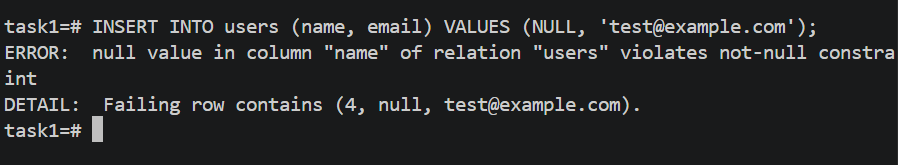
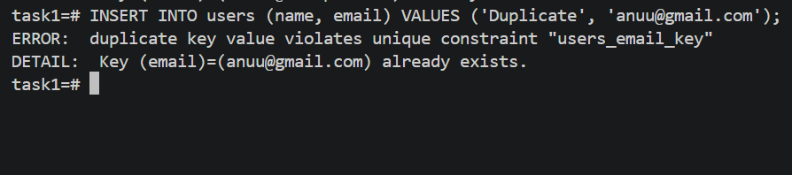
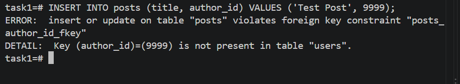
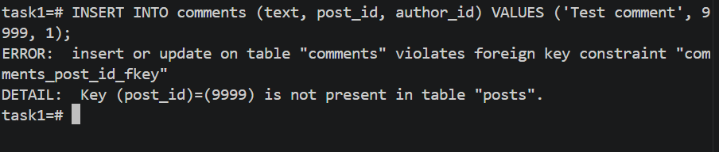
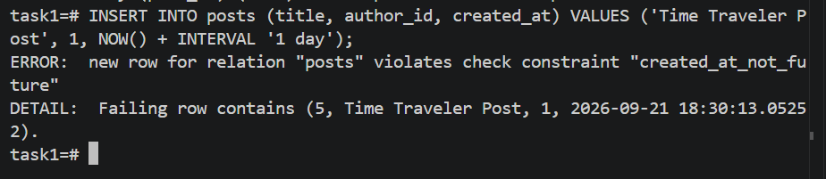

# Constraint Violation Proof

Each test below was executed against the live PostgreSQL database. Every invalid `INSERT` was rejected by the corresponding database constraint.

## 1. NOT NULL: `users.name`

```sql
INSERT INTO users (name, email)
VALUES (NULL, 'test@example.com');
```



PostgreSQL rejected the row because `users.name` is defined as `NOT NULL`:

```text
ERROR: null value in column "name" of relation "users" violates not-null constraint
DETAIL: Failing row contains (4, null, test@example.com).
```

## 2. UNIQUE: `users.email`

```sql
INSERT INTO users (name, email)
VALUES ('Duplicate', 'anuu@gmail.com');
```



PostgreSQL rejected the row because the email already exists:

```text
ERROR: duplicate key value violates unique constraint "users_email_key"
DETAIL: Key (email)=(anuu@gmail.com) already exists.
```

## 3. FOREIGN KEY: `posts.author_id`

```sql
INSERT INTO posts (title, author_id)
VALUES ('Test Post', 9999);
```



PostgreSQL rejected the row because user `9999` does not exist:

```text
ERROR: insert or update on table "posts" violates foreign key constraint "posts_author_id_fkey"
DETAIL: Key (author_id)=(9999) is not present in table "users".
```

## 4. FOREIGN KEY: `comments.post_id`

```sql
INSERT INTO comments (text, post_id, author_id)
VALUES ('Test comment', 9999, 1);
```



PostgreSQL rejected the row because post `9999` does not exist:

```text
ERROR: insert or update on table "comments" violates foreign key constraint "comments_post_id_fkey"
DETAIL: Key (post_id)=(9999) is not present in table "posts".
```

## 5. CHECK: `posts.created_at` cannot be in the future

```sql
INSERT INTO posts (title, author_id, created_at)
VALUES ('Time Traveler Post', 1, NOW() + INTERVAL '1 day');
```



PostgreSQL rejected the row because `created_at` cannot be later than the current time:

```text
ERROR: new row for relation "posts" violates check constraint "created_at_not_future"
DETAIL: Failing row contains (5, Time Traveler Post, 1, 2026-09-21 18:30:13.05252).
```

## Result

All five invalid inserts were rejected. No invalid rows were added to the tables.

The reported IDs `4` and `5` do not mean those rows were inserted. PostgreSQL sequences can advance before a failed insert, so gaps in generated IDs are normal.

To verify the current row counts directly, run:

```sql
SELECT COUNT(*) AS users_count FROM users;
SELECT COUNT(*) AS posts_count FROM posts;
SELECT COUNT(*) AS comments_count FROM comments;
```

With the original seed data, the expected counts are:

```text
users: 3
posts: 3
comments: 3
```
